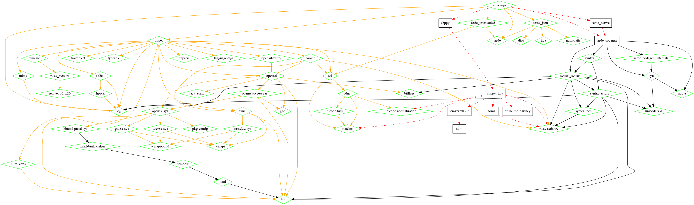

# gitlab-api-rs

Rust wrapper to the GitLab API.

## Synopsis

[GitLab](https://about.gitlab.com/) is an amazing tool of which I am a big fan. For most of the tasks, the web UI is more than enough but for some tasks nothing beats scripting them. The [GitLab API](https://docs.gitlab.com/ce/api/) is there to allow scripting actions on the GitLab server.

The excellent [python-gitlab](https://github.com/gpocentek/python-gitlab) allows to use the API from Python, but when playing with it I find myself missing [Rust](https://www.rust-lang.org/)'s static typing. Hence this implementation in Rust.

The (v3) API is quite long, so the parts I need will be implemented first.

## Possible Goals

* 100% coverage of the API;
* Library for full API manipulation;
* Command line tool for basic tasks and queries;

## Dependencies

Depends (directly) only on `serde`, `serde_json` and `hyper`.

## Licensing

gitlab-api-rs is distributed under the terms of both the MIT license and the Apache License (Version 2.0).

See [LICENSE-APACHE](./LICENSE-APACHE) and [LICENSE-MIT](./LICENSE-MIT) for details.
